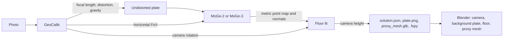

# AI Camera Match for Blender

A Blender add-on that matches a 3D camera to a single photograph without drawing vanishing lines. It does what fSpy does, but automatically: it estimates the focal length, lens distortion, camera roll and pitch, and the camera height above the floor, then builds the matched camera, background plate, floor plane and a textured proxy mesh in Blender.

The add-on does not introduce a new model. It combines existing open-source work:

- [GeoCalib](https://github.com/cvg/GeoCalib) (ECCV 2024) estimates the focal length, distortion and gravity direction.
- [MoGe-2 / MoGe-3](https://github.com/microsoft/MoGe) (Microsoft Research) estimates metric 3D geometry, used for the camera height and the proxy mesh.
- [fSpy](https://github.com/stuffmatic/fSpy) and [fSpy-Blender](https://github.com/stuffmatic/fSpy-Blender) define the workflow and the `.fspy` project format that the add-on also writes.

Full credits and licences are in [ai_camera_match/THIRD_PARTY_NOTICES.md](ai_camera_match/THIRD_PARTY_NOTICES.md). The research behind the design is in [Automated AI Camera Matching.md](Automated%20AI%20Camera%20Matching.md).

## Contents

- [Quick Start](#quick-start)
- [How It Works](#how-it-works)
- [Using the Add-on](#using-the-add-on)
- [Headless and Batch Use](#headless-and-batch-use)
- [Output Files](#output-files)
- [Measured Results](#measured-results)
- [Repository Structure](#repository-structure)
- [Development](#development)
- [Troubleshooting](#troubleshooting)
- [Known Limitations](#known-limitations)
- [Credits and Licence](#credits-and-licence)

## Quick Start

Requirements: Blender 4.2 or newer (tested on Blender 5.1.2 on Windows 11), an internet connection for the one-time setup, and about 6 GB of free disk space. An NVIDIA GPU is recommended; CPU works but is slower.

1. **Build the extension package.** From the repository root:

   ```bash
   mkdir dist
   blender --command extension build --source-dir ai_camera_match --output-dir dist
   ```

   This creates `dist/ai_camera_match-1.0.0.zip`. On Windows, `blender` is `"C:\Program Files\Blender Foundation\Blender 5.1\blender.exe"`.

2. **Install it in Blender.** Open Edit > Preferences > Get Extensions, open the drop-down menu at the top right, choose **Install from Disk**, and select the zip. Enable **AI Camera Match**.

3. **Allow online access.** In Edit > Preferences > System > Network, turn on **Allow Online Access**. The installer refuses to run without it.

4. **Install the solver environment.** In the add-on's preferences, choose the **PyTorch Build** that fits your machine (CUDA 12.6 for most NVIDIA GPUs, CUDA 12.8 for RTX 50 series, CPU only without an NVIDIA GPU, PyPI default on macOS), then click **Install Solver Environment**. This creates a separate Python virtual environment and installs PyTorch, GeoCalib and MoGe into it. It takes several minutes; the status line shows each step. When done it reads `Installed. torch <version> cuda True` (or `False` on CPU).

5. **Match a camera.** In the 3D Viewport press `N`, open the **Camera Match** tab, pick an **Image**, and click **Match Camera**. The first solve also downloads the model weights (about 1.5 GB). Press `Esc` to cancel a running solve.

## How It Works

Heavy machine-learning libraries cannot be installed cleanly into Blender's own Python, so the add-on runs the models in a separate process. Blender only starts the solver, reads its result file and builds the scene.



1. **Calibration (GeoCalib).** Gives one focal length in pixels, lens distortion for non-pinhole lens models, and the world up direction in the camera frame. The principal point is assumed to be at the image centre. For distorted lenses the plate is undistorted, so the Blender camera (which has no lens distortion) matches `plate.png`.
2. **Rotation.** The up vector fixes roll and pitch. Yaw cannot be known from one photo, so the camera always looks along world +Y. The rotation code is in [geometry.py](ai_camera_match/worker/aicm_worker/geometry.py).
3. **Geometry (MoGe).** MoGe runs on the undistorted plate, resized to the **Depth Resolution** long edge. GeoCalib's horizontal field of view is passed in, so the point map agrees with the camera.
4. **Camera height.** Points below the camera whose normals face up are voted by height. The lowest height with at least half of the strongest support becomes the floor, so a large table does not beat a visible floor. A plane is then refitted a few times, and the camera height is the median distance to the floor points. The visible floor therefore lands at Z = 0. If no floor is found, the **Fallback Height** (default 1.6 m) is used and a warning is shown.
5. **Scene.** The add-on creates a collection `Camera Match <image name>` holding `<name>_camera`, `<name>_floor` (a 20 m wireframe plane at Z = 0) and `<name>_proxy` (the textured MoGe mesh). It sets the render resolution to the plate size, the plate as the camera background image, and the scene camera. Solving the same image again updates these objects in place.

## Using the Add-on

### Panel settings (3D Viewport > Sidebar > Camera Match)

| Setting                   | Default      | Purpose                                                                                                                                                        |
| :------------------------ | :----------- | :------------------------------------------------------------------------------------------------------------------------------------------------------------- |
| Image                     | empty        | Photo to match.                                                                                                                                                |
| Lens                      | Pinhole      | GeoCalib camera model: Pinhole, Simple Radial, Radial, or Fisheye (Divisional). Non-pinhole models use GeoCalib's `distorted` weights and undistort the plate. |
| Estimate Height and Scale | on           | Runs MoGe for metric depth. Off gives only rotation and focal length, at the fallback height.                                                                  |
| Depth Model               | MoGe-2 ViT-L | `Ruicheng/moge-2-vitl-normal` (331M parameters), `-vitb-normal` (104M), `-vits-normal` (35M), or Custom.                                                       |
| Model (Custom)            | empty        | Any MoGe-2 or MoGe-3 Hugging Face repo id or local checkpoint path. The name must contain `moge-2` or `moge-3`.                                                |
| Depth Resolution          | 1024         | Long edge in pixels for MoGe and the proxy mesh.                                                                                                               |
| Proxy Mesh                | on           | Imports `proxy_mesh.glb`.                                                                                                                                      |
| Fallback Height           | 1.6 m        | Camera height when no floor is found or depth is off.                                                                                                          |
| Floor Plane               | on           | Adds the wireframe floor at Z = 0.                                                                                                                             |

Buttons: **Match Camera** runs a solve, **Import Solution** builds the scene from an existing `solution.json` (also under File > Import > AI Camera Match), and the folder icon opens the solve folder.

### Add-on preferences

| Preference         | Default                           | Purpose                                                                                                      |
| :----------------- | :-------------------------------- | :----------------------------------------------------------------------------------------------------------- |
| Solver Environment | extension user folder `env`       | Where the virtual environment is created. Model weights and pip downloads go to a `cache` folder next to it. |
| Base Python        | Blender's bundled Python          | Python 3.10 or newer used to create the environment.                                                         |
| PyTorch Build      | CUDA 12.6 (PyPI default on macOS) | Index used for `torch` and `torchvision`.                                                                    |
| Device             | Auto                              | `auto` picks CUDA, then Metal, then CPU.                                                                     |

### Where results are saved

If the `.blend` file is saved, results go to `camera_match/<image name>/` next to it, so plates and meshes travel with the project. Otherwise they go to `solves/<image name>/` in the extension's user folder. Save the `.blend` before solving if you want the files kept with the project.

## Headless and Batch Use

The solver is an ordinary command-line program. With the solver environment's Python (for the default location on Windows this is inside `%APPDATA%\Blender Foundation\Blender\<version>\extensions\.user\user_default\ai_camera_match\env`):

```bash
# Run from the ai_camera_match/worker folder, or put it on PYTHONPATH.
python -m aicm_worker --image photo.jpg --out-dir solves/photo
```

| Option               | Default                       | Meaning                                                    |
| :------------------- | :---------------------------- | :--------------------------------------------------------- |
| `--image`            | required                      | Input photo.                                               |
| `--out-dir`          | required                      | Output folder.                                             |
| `--camera-model`     | `pinhole`                     | `pinhole`, `simple_radial`, `radial`, `simple_divisional`. |
| `--depth-model`      | `Ruicheng/moge-2-vitl-normal` | MoGe-2/3 repo id or path, or `none`.                       |
| `--depth-resolution` | `1024`                        | Long edge for MoGe.                                        |
| `--default-height`   | `1.6`                         | Fallback camera height in metres.                          |
| `--device`           | `auto`                        | `auto`, `cuda`, `cpu` or `mps`.                            |
| `--no-fp16`          | off                           | Run MoGe in full precision.                                |
| `--no-mesh`          | off                           | Skip `proxy_mesh.glb`.                                     |
| `--no-fspy`          | off                           | Skip the `.fspy` project.                                  |

Progress is printed as JSON lines. Model weights are cached under `TORCH_HOME` (GeoCalib) and `HF_HOME` (MoGe) when those variables are set; the add-on sets both to its cache folder.

Then build the scene in a background Blender session with the add-on enabled:

```bash
blender -b -P build_scene.py
```

```python
# build_scene.py
import bpy
bpy.ops.aicm.import_solution(filepath="solves/photo/solution.json")
bpy.ops.wm.save_as_mainfile(filepath="photo_matched.blend")
```

`bpy.ops.aicm.solve()` also works in background mode: it runs the solver synchronously using the scene's Camera Match settings.

## Output Files

| File                | Contents                                                                                                                                                                                                                                            |
| :------------------ | :-------------------------------------------------------------------------------------------------------------------------------------------------------------------------------------------------------------------------------------------------- |
| `solution.json`     | Image size; focal length, FoV and distortion; roll, pitch, up vector and GeoCalib uncertainties in degrees; Blender `matrix_world`; camera height and its source (`ground_plane` or `default`); floor fit details; models used; run time; warnings. |
| `plate.png`         | The analysed image: EXIF orientation applied and, for distorted lenses, undistorted. Used as the camera background.                                                                                                                                 |
| `proxy_mesh.glb`    | Textured mesh of the MoGe point map in Blender world space (glTF Y-up; Blender's importer converts it).                                                                                                                                             |
| `<image name>.fspy` | fSpy project for the [fSpy-Blender](https://github.com/stuffmatic/fSpy-Blender) importer and other `.fspy` readers. It holds no vanishing points, so opening it in the fSpy app itself is not supported.                                            |
| `solve.log`         | Full solver output, written when solving from Blender.                                                                                                                                                                                              |

## Measured Results

Measured on 30 September 2026 on Windows 11, Python 3.11, PyTorch 2.14.0+cu126, NVIDIA GeForce GTX 1650 (4 GB), default settings unless stated. Times are the `seconds` field of `solution.json` with weights already cached.

| Image                                 | Settings                           | Solve time | Result                                                                    |
| :------------------------------------ | :--------------------------------- | :--------- | :------------------------------------------------------------------------ |
| MoGe `01_HouseIndoor.jpg` (1500x1000) | defaults, via the Blender operator | 30.9 s     | 20.5 mm lens, roll -0.1, pitch -0.4 degrees, height 1.12 m from the floor |
| MoGe `03_Traffic.jpg`                 | defaults                           | 29.1 s     | height 2.39 m from the floor, floor tilt 4.7 degrees                      |
| GeoCalib `fisheye-skyline.jpg`        | Fisheye (Divisional)               | 38.9 s     | k1 -0.405, plate undistorted                                              |
| GeoCalib `pinhole-church.jpg`         | depth off                          | 5.6 s      | pitch 38.4 degrees, fallback height 1.6 m                                 |

The first solve took 288 s because it included downloading the weights.

The **Install Solver Environment** operator was also run headlessly with Blender 5.1.2's bundled Python 3.13 and the CPU-only PyTorch build. It finished with `Installed. torch 2.14.0+cpu cuda False`, and a CPU solve of `01_HouseIndoor.jpg` with MoGe-2 ViT-S in that environment took 36.3 s (including the ViT-S weight download) and gave roll -0.09, pitch -0.43 degrees and a 1.22 m height. Checks run on these results:

- Rendering the proxy mesh through the solved camera in Blender reproduced the plate with 95.1% pixel coverage, a mean absolute colour difference of 0.013, and best alignment at a 0 px shift.
- For the indoor image, the 5th percentile of the proxy mesh's vertex heights was 0.002 m, so the visible floor sits at Z = 0.
- The `.fspy` files imported with the upstream fSpy-Blender add-on gave the same camera matrix (maximum difference 1.4e-7) and field of view.

Accuracy against ground-truth cameras is not measured in the current repository. See the GeoCalib and MoGe papers for benchmark results.

## Repository Structure

```text
.
|-- ai_camera_match/                 Blender extension (this folder is packaged)
|   |-- blender_manifest.toml        Extension metadata, permissions, licence
|   |-- __init__.py                  Registration and File > Import menu entry
|   |-- properties.py                Add-on preferences and per-scene settings
|   |-- operators.py                 Install, solve, import-solution and open-folder operators
|   |-- jobs.py                      Background subprocess runner and environment install steps
|   |-- scene.py                     Builds the camera, plate, floor and proxy mesh
|   |-- ui.py                        3D Viewport sidebar panel
|   |-- LICENSE                      GPL-3.0 text shipped with the package
|   |-- THIRD_PARTY_NOTICES.md       Credits and licences of the projects used
|   `-- worker/                      Solver, run in its own Python environment
|       |-- requirements.txt         Solver dependencies (installed after PyTorch)
|       |-- requirements-nodeps.txt  GeoCalib and MoGe at pinned commits
|       `-- aicm_worker/
|           |-- cli.py               Command-line pipeline and solution.json writer
|           |-- models.py            GeoCalib and MoGe wrappers
|           |-- geometry.py          Rotation, FoV and floor fitting (NumPy only)
|           `-- fspy.py              .fspy project writer
|-- tests/test_geometry.py          Unit tests for geometry.py and fspy.py
|-- Automated AI Camera Matching.md  Research survey behind the design
`-- LICENSE                          GPL-3.0-or-later
```

## Development

Run the unit tests (they need only NumPy and pytest, no GPU or models):

```bash
python -m venv .venv
.venv/Scripts/python -m pip install numpy pytest     # .venv/bin/python on Linux and macOS
.venv/Scripts/python -m pytest tests
```

Expected result: `13 passed`.

Validate the extension manifest:

```bash
blender --command extension validate ai_camera_match
```

To work on the solver outside Blender, install PyTorch and then the two requirement files into the same environment, exactly as the add-on does:

```bash
.venv/Scripts/python -m pip install torch torchvision --index-url https://download.pytorch.org/whl/cu126
.venv/Scripts/python -m pip install -r ai_camera_match/worker/requirements.txt
.venv/Scripts/python -m pip install --no-deps -r ai_camera_match/worker/requirements-nodeps.txt
```

## Troubleshooting

| Problem                                                        | Likely cause                                                      | How to check                                         | Fix                                                                              |
| :------------------------------------------------------------- | :---------------------------------------------------------------- | :--------------------------------------------------- | :------------------------------------------------------------------------------- |
| "Enable ... Allow Online Access first"                         | Blender's online access is off                                    | Preferences > System > Network                       | Turn on Allow Online Access and retry.                                           |
| Install fails at "Installing PyTorch"                          | No wheel for this Python or platform on the chosen index          | Read `logs/install.log` in the extension user folder | Pick another PyTorch Build, or set Base Python to a Python 3.10 to 3.13 install. |
| "Install the solver environment ... first"                     | The environment's Python was not found                            | Preferences show "not installed"                     | Run Install Solver Environment, or point Solver Environment to an existing one.  |
| Solve fails with `CUDA out of memory`                          | GPU memory too small for the model                                | `solve.log` in the solve folder                      | Choose MoGe-2 ViT-S or ViT-B, or lower Depth Resolution.                         |
| Solve fails offline                                            | Weights not downloaded yet and online access is off               | `solve.log`                                          | Allow online access for the first solve.                                         |
| Warning "No floor found below the camera"                      | No upward-facing surface below the camera (sky, close-up, aerial) | `solution.json` `height_source` is `default`         | Set Fallback Height to the known height, or scale the scene by a known object.   |
| Warning "The fitted floor is N degrees off GeoCalib's horizon" | GeoCalib and MoGe disagree, or a tabletop or slope was picked     | Look at the floor grid over the plate                | Try another lens model, or trust the horizon and adjust the height by hand.      |
| Camera looks tilted on a cropped photo                         | The principal point is not at the image centre                    | Compare with the uncropped original                  | Use the uncropped image. Cropped plates are not supported.                       |

## Known Limitations

- **Yaw and position.** One photo cannot give heading, so the camera always faces +Y from X = Y = 0. Rotate or move the whole setup to fit your scene.
- **Principal point.** Both models assume the optical centre is at the image centre. Off-centre crops and shifted lenses give pitch and roll errors.
- **Scale.** Height comes from MoGe's learned metric scale. Scenes without familiar objects (aerial, macro, abstract) can be off in scale while angles stay correct.
- **Floor choice.** The lowest well-supported horizontal surface is taken as the floor. Stairs, slopes and scenes where the floor is barely visible can pick the wrong surface.
- **Lens distortion.** Blender cameras have no distortion, so distorted photos are matched through the undistorted `plate.png`, not the original.
- **MoGe-3.** The code supports MoGe-3 checkpoints, but they need [FlexGEMM](https://github.com/JeffreyXiang/FlexGEMM), which the installer does not install, and MoGe notes that macOS is not supported for MoGe-3. MoGe-3 was not tested here.
- **Not tested:** the modal UI flow in an interactive Blender window (the operators, installer and scene building were run headlessly in Blender 5.1.2), Linux, macOS, and the CUDA 12.8 build.
- **Extensions platform.** The add-on downloads Python packages into its own environment at runtime, so it is distributed as a zip rather than through extensions.blender.org.

## Credits and Licence

This add-on is licensed under GPL-3.0-or-later ([LICENSE](LICENSE)), the licence used by Blender add-ons and by fSpy and fSpy-Blender.

It builds on GeoCalib (Apache-2.0 code, CC-BY 4.0 weights) by Alexander Veicht, Paul-Edouard Sarlin, Philipp Lindenberger and Marc Pollefeys; MoGe (MIT code and weights) by Microsoft Research; and fSpy and fSpy-Blender (GPL-3.0) by Per Gantelius. [Atlas Camera](https://github.com/mikejamesvfx/atlas-camera) is related prior art. None of their source code is copied into this repository; the solver environment installs GeoCalib and MoGe from their official repositories at pinned commits. See [THIRD_PARTY_NOTICES.md](ai_camera_match/THIRD_PARTY_NOTICES.md) for details and the papers to cite.
